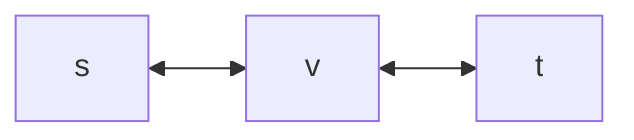

---
aliases:
  - Data structure
  - Algorithm
---

> [!NOTE] Data structure & Algorithm
> 추상적인 내용 중에선 가장 기본적인 내용이 아닐까 생각하는 과목.
> 두 과목이 너무 밀접해 사실상 하나의 과목이다.

# 자료구조

자료구조는 왜 많을까? 여러 자료구조들은 특화된 연산이 있다. 예를 들면 스택의 경우 DFS 에 특화되어 있고, 큐는 BFS 에 최적화된 구조이다. 최소, 최대를 빨리 찾는 구조도 있고, 존재, 부재를 빨리 찾는 구조도 있다.

어떤 일을 할 때 떠오르는 자료구조가 있어야 하는 것이다... 더 나아가면 상황에 딱 맞는 데이터 구조를 직접 구현할지도 모른다.

주로 등장하는 연산들
- 검색
- 선택 (인덱스)
- 최대, 최소
- 전, 후 요소 선택
- 랭크 (선택의 역연산)
- 삽입, 제거

## 그래프

자세한 내용은 [[그래프]]를 참조.

노드 (정점, vertex, node) 엣지 (간선, edge, arc) 으로 이루어진 자료구조.

## Heap

루트가 최솟값을 갖는 트리형 자료구조.

구현시 포인터를 사용한 트리 말고 배열로 구현하는 편이다. (오버헤드가 작아짐)

배열로 구현하면 Insertion 이 그냥 어레이 뒤에 붙이는 굉장히 섹시한 연산이 된다. (트리 밸런스를 알아서 적당히 맞춰준다.)

응용
- 최솟값을 자주 추출해야 하는 경우
- Priority queue 로 사용하는 경우
- 알고리즘 최적화 (Dijkstra's)
- Median-heap
	- 힙의 연산이 구조를 유지하는 식으로 작동하는 걸 응용한다. 작은 절반은 max-heap 에, 큰 절반을 min-heap 에 담아 초기화 하면, Median 을 반출하는 힙 완성! 이렇게 응용도 가능한 것이다.
	- Max, min 이라는 개념에서 살짝 벗어나서 생각해보면 여러 재밌는 구현이 될 것 같기도 하다.

### 러닝타임에 대한 노트

Heap 구조에서, random insertion 의 경우 $O(1)$ 의 러닝타임을 갖는다.

처음엔 좀 비직관적으로 느껴져서 당황했는데, 생각해보면 이해하기 쉽다. 힙 구조에서 절반은 leaf node 인데, 그렇다는 건 삽입되는 데이터는 절반의 확률로 leaf 가 된다는 것이고, 최대 한번의 bubbling 만 일어나게 된다.

만약 25% ~ 50% 사이의 값이 삽입되는 경우 두 번, 12.5% ~ 25% 사이의 값이 삽입되는 경우 세 번의 bubbling 이 일어나는 식이므로, On average 로 상수번 (2번) 의 bubbling 만 일어나기 때문에 $O(n)$ 의 러닝타임을 갖는다.

## Stack and Queue

## Bloom filter

Hash table 의 변형으로 볼 수 있다. Hash table 과 마찬가지로 매우 빠른 lookup 연산이 가능. 삽입도 빠르다. 
- Hash table 보다 공간을 아낄 수 있다.
- 어... 사실 객체를 담지는 못한다. (존재 여부만 체크 가능)
- 일반적인 구현으론 삭제가 구현되지 않았다.
- 위양성 (false positive) 을 보일 수 있음.
	- 없는데 있다고 (positive) 말하는 것.
	- **있는 것은 확실히 있다고 보장**한다. -> 있는데 없다고 (negative) 하는 경우는 없다는 것.

아니 이런 걸 어따 쓰나요?
- 스펠 체크 (없는 단어를 빨리 찾아준다. 지금은 잘 안씀?)
- 금지된 비밀번호 리스트 체크
- 네트워크 라우터
	- 데이터가 사이즈가 큰데다, 빠른 속도가 필요하다.

길이 $n$ 의 비트 어레이와 $k$ 개의 해시 함수로 구성되어 있다. 비트 어레이가 아니라 integer array 를 사용하면 삭제도 지원한다. (collision count 역할을 해줘서... 이 경우 counting filter 라고 한다. 이건 이거대로 문제가 또 있다...)

위양성 확률 $\leq [1 - e^{-k/b}]^{k}$  
b 는 비트 어레이 크기 / 데이터 사이즈다. (~요소 당 할당 가능한 비트 수)
b 를 고정한다면,  $k \sim \ln{2} \times b$ 로 에러 확률이 최소가 된다. (미분해보셈)
그러면 위양성 확률은 $\sim (1/2)^{b\ln{2}}$
예를 들면 b = 8, 해시 함수 수 5~6개 정도면 2% 정도가 된다.

## Union-find
그래프에서 정점들의 **배타적인** 집합을 생각할 수 있다. 각 집합들은 대표 정점 (parent, pointing node) 을 이용해 구분할 수 있고, 아래 두 연산을 생각할 수 있다.
- FIND : 대표 정점을 구해 어떤 집합에 속하는지 체크하는 연산.
- UNION :  두 집합을 하나로 합친다.

MST 를 구하는 알고리즘을 위해 쓰이기도 한다. Union-find 를 통해 사이클 형성 여부 체크를 건너뛸 수 있기 때문. 특정 상황에서 매우 좋은 자료구조이니 알아서 손해볼 건 없다. [[그래프]] 문서를 참고.

## Balanced Binary Search Tree

여러 구현들이 있다...

AVL tree : Red-black tree 에서 삽입, 삭제가 좀 다름
Spray tree : 서치도 좀 다름
B-tree : binary 가 아닐 수 있음. DB 에서 구현되곤 한다. 

Java 에선 Red-black tree 가 사용됨. (논문 낼 때 검정, 빨강 프린터밖에 없었다고 한다...)

데이터 구조가 Invariant 를 갖고 있다.
- 각 노드들은 red or black 이다.
- 루트는 black 이다.
- 2연속 red node 를 금지한다.
- 모든 root -> NULL 경로는 같은 black node 수를 포함한다.

위 조건을 만족하면 아래 명제가 참이된다.
- 길이 3인 선형 체인은 금지된다.
- 완벽히 균형 잡힌 올블랙 트리는 Red-black tree 다.

삽입은 일단 red node 로 삽입하고, red-red node 가 만들어지면 root 까지 올려보내서 해결한다. (case 1, 삼촌노드가 red 인 경우)
삼촌노드가 black 인 경우를 만나면 rotation 이 필요

삭제시 Binary search tree 에서 했던 것 처럼 pred or succ 노드로 대체한다. 이 때 룰 위반이 되는 3가지 케이스가 가능한데, 처리하기 위한 로직이 필요하다.

한가지 주목할 점으로는 병렬 알고리즘이 알려져 있다는 것이다. 

## Hash Tables
Dictionary 라고도 한다.

자체적으로 정렬이나 범위를 지원하지 않는 대신, 참조 (Lookup) 이 미친듯이 빠르다. 삽입 삭제도 모두 $O(1)$ 의 시간 복잡도를 갖는다.

키 중복을 허용하지 않는다. (물론 MultivalueMap 같은게 있긴 하지만 이것도 키는 하나야~)

**제대로 구현되었다면** 작동 보장성이 완벽해야 함.

2-SUM 문제를 $O(n)$ 으로 푼다. Lookup 을 자주해야 하는 문제라면 Hash Table 을 쓰는거다. Dynamic programming 도 마찬가지다. Blacklist 관리 등 진짜 많은 응용을 생각해 볼 수 있다. 걍 숨쉬듯 쓰는 수준임.

구현에 있어서 주의해야 할 것은 해시 충돌이다. [생일 문제](https://ko.wikipedia.org/wiki/%EC%83%9D%EC%9D%BC_%EB%AC%B8%EC%A0%9C)에서 느낄 수 있듯 가능성의 수가 많더라도 Trial 수가 늘어나면 생각보다 빨리 Trial 사이의 해시 충돌이 발생한다. **Chaining** 혹은 **Open addressing** 으로 충돌을 우회한다.

### Pathological Data
알고리즘이 최악으로 작동하도록 구성된 데이터.

특정 해시 알고리즘을 쓰는 해시테이블에 대해서 무조건 충돌하는 키들만 가진 경우.

### Universal Hash Function
모든 해시 함수는 Pathological data 가 있을 수 있다. 좋은 해시 함수를 고르려면... 암호화 기술, 랜덤 요소를 섞어야 한다.

충돌확률이 낮은 (1/bin) 해시 함수들의 집합에서, 랜덤하게 하나를 골라 사용하는게 Universal Hash Function 이다. 적절한 Hash function 에 사용할 재료를 랜덤으로 선택해 사용하는 식. 

# 알고리즘
자주 사용하던 말이지만 애초에 알고리즘이란 단어가 뭘까? [영문 위키피디아](https://en.wikipedia.org/wiki/Algorithm)를 찾아보면 이렇게 설명하고 있다.

> In [mathematics](https://en.wikipedia.org/wiki/Mathematics "Mathematics") and [computer science](https://en.wikipedia.org/wiki/Computer_science "Computer science"), an **algorithm** ([/ˈælɡərɪðəm/](https://en.wikipedia.org/wiki/Help:IPA/English "Help:IPA/English") [ⓘ](https://en.wikipedia.org/wiki/File:En-us-algorithm.ogg "File:En-us-algorithm.ogg")) is a [finite](https://www.merriam-webster.com/dictionary/finite "mwod:finite") sequence of [mathematically rigorous](https://en.wikipedia.org/wiki/Rigour#Mathematics "Rigour") instructions, typically used to solve a class of specific [problems](https://en.wikipedia.org/wiki/Computational_problem "Computational problem") or to perform a [computation](https://en.wikipedia.org/wiki/Computation "Computation").

특정 문제를 해결하기 위한 유한한 지시문.

단어는 어디서 온 걸까? 어원학 (Etymology) 섹션을 보면 서기 800년 즈음 페르시아 과학자 [Muḥammad ibn Mūsā al-Khwārizmī](https://en.wikipedia.org/wiki/Al-Khwarizmi "Al-Khwarizmi") 에서 왔다고 한다. 

이 과목에선 이런 것들을 다루고 있다.
- 특정 문제를 해결하기 위한 알고리즘 소개 및 디자인 기법
- 알고리즘을 평가하는 방법

## 점근적 표기법 (Asymptotic notation)

[[점근적 표기법]]은 알고리즘의 러닝 타임 혹은 메모리 사용량을 평가하기 위한 표기법이다. 

Big-Oh 표기법이 가장 인기가 좋지만, 다른 두가지도 알아둬야 좋다.

## 병합 정렬 (Merge Sort) & 분할 정복 알고리즘 (Divide and Conquer)

분할 정복은 큰 문제를 작은 문제로 나누고, 알고리즘을 재귀적으로 적용하는 패턴이다.

전설적인 [존 폰 노이만](https://en.wikipedia.org/wiki/John_von_Neumann)이 1945년 개발한 병합 정렬은 분할 정복 알고리즘의 대표적인 예시 중 하나로, 아래 연산을 반복한다.

1. 배열을 받는다. 길이가 2 보다 작으면 리턴한다.
2. 배열을 절반으로 나눈다.
3. 각 배열을 정렬한다. (recursive call)
4. 정렬된 두 배열에서, 각각 왼쪽부터 원소를 뽑아 서로 비교한다. 작은 쪽을 결과 배열에 차례로 저장한다. 저장된 경우 다음 원소를 선택한다.
	1. 두 원소가 같은 경우 왼쪽 배열에서 나온 원소를 저장한다.
5. 결과 배열을 리턴한다.

병합 정렬은 이런 특징이 있다.
- Sub problem 들의 크기가 동일하다. 
- 안정된 정렬 방법이다. (Stable sort)
- $O(n\log{n})$ 의 시간 복잡도를 갖는다.
- Worst-case 라도 $O(n\log{n})$ 이다.

후술할 Master method 를 쓰지 않고, 병합정렬의 시간 복잡도를 **생각보다 쉽게** 구해볼 수 있다.

- 각 깊이에서 두 번의 재귀호출이 있다.
- 재귀마다 하위문제의 크기가 절반이 되므로 총 깊이는 $\log_2{n}$ 이다.
- 각 깊이에서 총 비교 횟수는 n 번이므로, 시간 복잡도는 $O(n\log{n})$ 이다.

알고리즘을 보면, 배열이 불균일하게 분할된 경우 비교를 덜 할 수 있긴하지만, Asymptotic behavior 에 영향을 주진 않는다.

### Counting Inversion

병합 정렬에 살짝 조미료를 더해서 만들 수 있는 알고리즘이다.

Inversion (혹은 inversion pair) 은 **정렬이 잘못된 정도**로 해석하면 되는 값이다. 참고로 수학의 군론, [Permutation](https://en.wikipedia.org/wiki/Parity_of_a_permutation)에서 유래한 단어 같다. 

교환 문제나, 좀 더 현실적인 응용으론 두 위시리스트의 비슷한 정도를 평가하는 데 사용된다.

병합 정렬의 4 번 단계에서, 오른쪽에 있는 원소가 선택될 때 왼쪽 배열에 남아있는 원소들의 수 들을 전부 합하면 된다.

왜 이 값이 inversion 인지는 왼쪽 배열과 오른쪽 배열이 어떤 성격인지 생각해보면 알 수 있다.

## Stranssen's Subcubic Multifilication

매트릭스 곱셈을 위한 알고리즘이다.

Recursive call 수와 sub problem set 의 수가 일치하지 않는 대표적인 케이스기도 하다.

Navie 한 매트릭스 곱셈을 살펴보면

$$
\begin{bmatrix}
a & b\\
c & d
\end{bmatrix}
\times
\begin{bmatrix}
e & f\\
g & h
\end{bmatrix}
\times
=
\begin{bmatrix}
ae + bg & af +bh\\
ce +dg & cf + dh
\end{bmatrix}
$$
손으로 푸는 식이면 사이즈 n x n 인 행렬에 대해서, $n^3$ 번의 곱셈 계산이 필요하다.

행렬을 4분할 해서 나눠도, 8개의 sub-cubic 원소를 알고있어야 할 것 같고, 서브-곱셈이 8번 있다.

하지만 Karatsuba's algorithm 과 마찬가지로, 덧셈을 좀 더 하는 대신 곱셈 재귀 호출을 줄일 수 있다.

재귀 호출 7번, 사이즈는 절반으로 떨어진다. sub-cubic 행렬 덧셈은 $n(O^2)$ 이다.

Master method 를 사용하면 (Leaf-heavy problem) 시간 복잡도는 $O(n^{\log_2{7}}) \sim O(n^{2.81})$ 이 된다. (참고로 Naive 한 매트릭스 곱셈도 Leaf-heavy problem 이다.)

## Master Method

[[Master method]] 는 분할 정복 알고리즘의 시간 복잡도를 계산하기 위한 하나의 기술이다.

Merge sort 처럼 분할이 간단한 경우는 적용 가능하지만, Quicksort 같이 분할이 일정하지 않은 경우 적용할 수 없으니 주의해야 한다.

## Quicksort

이름이 시사하듯 일반적으로 병합 정렬보다 빠르다.

Pivot 을 선택하고, Pivot 왼쪽엔 Pivot 보다 작은 원소를, 오른쪽은 큰 원소가 배치되도록 스왑을 반복하다.

(이 과정을 구현할 때 있어서 포인터 i, j 이 필요하다.)

Quicksort 의 특징은 이렇다.

- Random pivot 을 사용 시, 최악의 경우 $O(n^2)$ 될 수 있다. 평균적으론 $O(n\log{n})$ 이다.
- 불안정 정렬이다.
- 부수적인 메모리 사용량이 적다.
- 각 depth 에서 **최소한 한 개의 원소가 제자리를 찾는다**. (중요))
- Memory locality 를 가져서, CPU cache hit rate 가 높다. (복잡한데 사실 별 말 아님)

좋은 pivot 을 찾기 위해 오버헤드를 주는 경우도 있다. (Median of median)

Memory locality 는 엄청 대단한 건 아니고, 정렬을 위해 새로운 Array 를 만들 필요가 없다는 뜻이다. (In-place sorting) 이라고도 한다.

다른 Array 를 참조하지 않으니 memory pointer 가 많이 움직이지 않아서, CPU 가 작업하기 좋다는 이야기. 병합 정렬의 경우는 정렬중인 Array 를 보관할 새 공간이 필요하다는 걸 알 수 있다.

## Selection

배열에서 n 번째로 큰 원소를 선택하는 알고리즘이다.

정렬과 비슷한 시간 복잡도를 가질 것 처럼 느껴지지만, 실제론 **선형 시간**내에 풀 수 있다.

Quicksort 를 변형한 알고리즘을 사용한다 (Randomized selection, R-Select)

Quicksort 의 중요한 특징 중 하나가 매 단계마다 한 원소는 자기 자리 (즉, 자신의 rank)를 찾는다는 것인데, 이를 응용한 것이다.

CS161 강의에선 Deterministic selection 을 소개한다. (Median of median)

## 비교 정렬의 한계

두 원소를 비교해야하는 정렬의 러닝 타임을 생각해보자.

Upper bound 는 $\begin{pmatrix}n\\2\end{pmatrix}$ 로 쉽게 생각할 수 있다. (모든 페어들을 비교하는 것으로 정렬에 과하게 충분하다.)

Decision tree 개념을 생각해야 lower bound 를 계산해 볼 수 있다. 특정 원소 페어를 비교한다는 것은 **모든 가능한 결과**들을 둘로 나눈다는 것에 해당한다. $[a, b, c,...,z]$ 라는 배열에서, $a, b$ 를 비교하면 $a>b$ 인 모든 가능성과 $a<b$ 인 모든 가능성 둘로 나눠지는 것이다.

모든 배열 가능성의 갯수는 $n!$ 이고, (스털링 근사를 통하면) 이 가능성들을 하나로 줄이기 위해선 $n\log{n}$ 번의 비교가 필요하게 된다.

## Graph Contraction

보통 Karger's algorithm 이라고도 하며, 그래프의 Min cut 을 찾기위한 무작위 (비결정적) 알고리즘이다.

알고리즘은 다음과 같다.
1. 엣지 하나를 무작위로 고른다.
2. 엣지의 두 정점을 하나로 합친다. 자기 자신을 가르키는 엣지는 없앤다. 
3. 정점이 둘 남을 때 까지 반복한다. 두 정점의 엣지 수를 리턴한다.

정점을 합칠 때 엣지들을 체크해줘야 하므로 $O(m^2)$ 의 러닝타임을 갖는다. (구현에 따라 더 괜찮아질 수 있음.)

이 알고리즘은 정답을 리턴하지 않을 수도 있다. 정답을 리턴할 확률은 $O(_{n}C_{2}^{-1})$ 인데, brute force 인 경우 $2^n$ 가지의 경우의 수를 체크해야 한다는 점을 고려하면 꽤 괜찮은 확률이다.

모두 실패할 확률이 $\sim1/n$ 되기 위해 대략 $n^2\log{n}$ 번 정도의 반복이 필요하다.

## Topological sort

Acyclic graph 에서, root 에서 멀어지는 순서로 정점을 배열한 것.

DFS 로 간단히 짤 수 있다.
1. index = n - 1
2. 다음 노드에 대해 방문한 적이 없다면 DFS
3. 현재 노드를 index 에 배정하고 index --

재귀로 짜면 간단한데, 스택을 이용한 Post-order 로 짜려면 생각보다 어렵다. 한 번은 스택을 pop 해야 한다고 생각해서, back tracking 을 못해 한참 헤맸음.

## Kosaraju's Two-Pass Algorithm

Strongly coupled component 를 찾기 위한 알고리즘.

1. 아크 방향을 전부 뒤집은 역방향 그래프를 만든다.
2. 역방향 그래프에서 DFS 로 finishing time 를 모든 정점별로 기록한다. (topological sort)
3. 정방향 그래프에서 앞서 기록한 순서대로 DFS 를 돌린다. SCC 별로 루프가 끝나게 된다.

이게 되는 이유?

정방향 그래프랑 역방향 그래프 모두 **같은 SCC** 를 갖고 있음. -> 멋진 파트
역방향 그래프에서 생산한 순서가 sink SCC 를 먼저 알려주기 때문에, 정방향에서 탐색하면 SCC 를 하나 씩 얻을 수 있다.

## Dijkstra's Algorithm

그래프에서 최단 거리를 찾는 알고리즘. $O(m\log{n})$ (adjacency list). 최소 값을 자주 열람하므로 Heap 구조와 쓰인다. Greedy algorithm 이다.

Greedy function 으로 단순히 "*현재 노드의 현재 최소 길이 + 체크할 엣지의 코스트*" 를 사용한다.

음의 간선을 갖는 그래프의 경우 틀린 값을 줄 가능성이 있다. 음의 간선을 갖게 되면, 초기엔 최솟값을 주지 않지만 나중에 최솟값이 되는 경로를 계산해 낼 수 없다. (=코스트가 단조증가하지 않는 경로)
- 다익스트라 알고리즘은 항상 최소값을 갖는 엣지를 우선 선택하기 때문에, 모든 정점을 거친 후 고려되지 않는 특정 경로의 엣지가 있을 수 있다.
- 모든 엣지를 한 번은 검사하지만, 모든 가능한 경로를 검사하는 게 아니기 때문이다.
- 만약 음의 루프를 가지게 되면 종료되지 않는 더 나쁜 결과가 나온다...

## Greedy Algorithm

각 선택의 순간에 최적이라고 생각되는 선택을 이어나가는 알고리즘들을 총칭한다.

감이 오겠지만 Local minimum 에 빠질 수 있는 알고리즘이다. (항상 그런 건 아니고, 경우에 따라서 그렇다.)

모든 가능성을 전부 뒤지지 않는다. (최적이 아니라고 판단되는 가능성은 고려하지 않게 됨.)

## Dynamic Programming

Greedy Algorithm 과 달리 최적해를 찾기 위해 필요한 가능성을 전부 조회한다.

다만 중복되는 부분을 캐시하는 식으로 최적화를 한다. (memoization)

## Bellman-Ford Algorithm

사용할 수 있는 edge 를 i 개로 제한한다.
i-1 일 때의 문제가 substructure 가 된다.

$O(mn)$ 성능으로 최단거리를 계산할 수 있다. Greedy algorithm 인 다익스트라보단 느리지만, Distributable 하게 구현될 수 있다. 

**Internet routing 에 응용될 수 있음.** (Bellman-Ford Algorithm 이 중요한 이유)
- 원래 알고리즘에서 Source->Target 를 뒤집는다. (Destination 만 중요해서)
- Asynchrony : 비동기적으로 최단거리 업데이트
- Push-based : 서로가 서로에게 능동적으로 알린다.
- 각 노드가 최단거리가 적힌 라우팅 테이블을 유지.
- RFC 1058

Routing 응용은 생각해 볼만한 점이 있다. 특히 Link failure 시 어떻게 처리해야 하는가의 문제가 있다.

v-t 엣지가 갑자기 끊어지면, v 가 기억하는 t 까지 거리는 무한대로 업데이트된다.
이후 s 가 v 에게 t 까지의 거리를 push 하게 되면 (s-v-t 로 기억하고 있으므로 2 이다.)
무한대보다 2 가 작으므로 v 는 3 으로 기록하는 오류가 생길 수 있다.
오류가 생기는 이유는 path 를 기억하지 않고, 결과값인 value 만 기억하고 있기 때문이다.

path 까지 기억하게 하면, 공간을 더 잡아먹지만 라우팅 정책을 더 세심하게 정할수도 있고, 위의 오류를 피해갈 수 있다.

> [!NOTE] Modified Bellman-Ford Algorithm
> Consider the following optimization to the Bellman-Ford algorithm. Given a graph $G=(V,E)$ with real-valued edge lengths, we label the vertices $V={1,2,3,…,n}$. The source vertex $s$ should be labeled "1", but the rest of the labeling can be arbitrary. Call an edge $(u,v)∈E$ _forward_ if $u<v$ and _backward_ if $u>v$. In every odd iteration of the outer loop (i.e., when $i=1,3,5,...$), we visit the vertices in the order from 1 to $n$. In every even iteration of the outer loop (when $i=2,4,6,...$), we visit the vertices in the order from $n$ to 1. In every odd iteration, we update the value of $A[i,v]$ using only the forward edges of the form $(w,v)$, using the _most recent_ subproblem value for $w$ (that from the current iteration rather than the previous one). That is, we compute $A[i,v]=min⁡{A[i−1,v],(w,v)A[i,w]+cwv}$, where the inner minimum ranges only over forward edges sticking into $v$ (i.e., with $w<v$). Note that all relevant subproblems from the current round ($A[i,w]$ for all $w<v$ with $(w,v)∈E$) are available for constant-time lookup. In even iterations, we compute this same recurrence using only the backward edges (again, all relevant subproblems from the current round are available for constant-time lookup). Which of the following is true about this modified Bellman-Ford algorithm?

위 알고리즘 fail 할 거라고 느꼈는데 (특히 길이 n 리니어 체인에서) 왜 아닌거지?

## Floyd-Warshall Algorithm

모든 source-target 페어에 대해 최단거리를 계산하는 알고리즘. $O(n^3)$ 의 러닝타임을 갖는다. 
중간에 거쳐가는 노드 $k$ 를 고려해 $i,j$ 페어로 만들어진 매트릭스를 업데이트해준다.
source $i$, target $j$, pass-by $k$ 총합 $n^3$ 이 되는 것.

## Johnson's Algorithm

Dijkstra 를 n 번 돌리는데, Re-weighting technique 를 쓴다. 솔직히 쫌 천재적인듯.

> [!NOTE] Re-weighting technique
> 모든 엣지의 원래 weight 를 $e$ 라고 하자. 여기서 각 vortex x 에게 $p_x$ 라는 값을 주고 새로운 weight $e'$ 를 이렇게 정의한다.
> $e' = e + p_s - p_t$
> 새로운 엣지 weight 를 사용하면, 모든 s-t path 의 cost 는 $p_s - p_t$ 만큼 shift 된다. 이를 이용해 negatice edge 를 양수로 만들어줄 수 있다.

Re-weighting 하기 위해 Ghost vertex 를 도입한다.

> [!NOTE] Ghost vertex
> Contents
다른 모든 vertex 로 가는 cost 0 인 Ghost vertex 를 추가한다. 이 vertext 는 기존 그래프의 shortest path 를 변화시키지 않는다. (0 cost 니까) 
Ghost vertex 에서 다른 모든 vertex 로의 shortest path 를 구하면, negative edge 를 상쇄하는 p 값을 얻을 수 있다! (아니 어떻게 이런 생각을;) 
여기선 Bellman-Ford 알고리즘을 1회 사용한다. (negative edge 케이스 처리)

새로운 그래프에서 Dijkstra 를 돌리면, $p_s - p_t$ 만큼 더해진 shortest path 가 구해진다. 좋은 점은 큐빅 타임인 Bellman-ford 를 안쓰고 $m\log{n}$ 인 Dijikstra 를 $n$ 번 돌리는게 더 빠르다는 것.

이 알고리즘이 가능한건 Re-weighting 이 shortest path 를 바꾸지 않는 symmetric transformation 이라는 것. Offset 이 존재하긴 하지만, shortest path 를 구성하는 path 는 바뀌지 않는다. Offset 은 $s$, $t$ 의 $p$ 값에만 의존하기 때문.

## Sequence Similarity

알고리즘이라기 보단 응용에 대한 이야기

두 시퀀스가 비슷하다는 것의 정의는 뭔가? 어떻게 측정할 것인가? 의 문제도 도메인에 따라 달라질 수 있을 것이다.

몇 번의 unit transform 을 거쳐야 같아질 수 있는가? 로 생각할 수 있다. Unit transform 은 이런 느낌으로 정의 가능하다.
- 공백 삽입 (길이 변화)
- 원소 변화

예를 들면 AB -> ABC 는 공백 삽입 + 원소 변화로 만들 수 있으니 penalty 2.

## Scheduling Weighted Job with Greedy Algorithm

가중치와 길이를 가진 Job 들을 어떤 순서로 배치할지 계산하는 문제여요 가중치와 완료까지 대기시간의 곱을 최적화 하는 문제.

신기하게도 $\omega_i / l_i$ 를 ordering parameter 로 잡으면 항상 $\Sigma\omega_i \bullet c_i$ 를 최적화 할 수 있음.

## Prim's Algorithm

Minimum spanning tree (MST) 문제를 $O(m\log{n})$ 에 풉니다.

MST 문제
- Undirected graph $G(V,E)$ 에서 정의한다.
- 아무 노드에서 시작해서 cycle 을 만들지 않는 한 가장 값싼 엣지만 통해 verte 를 추가한다.

Greedy algorithm 이 그렇듯 heap 구조로 최적화한다.
heap 엔 가장 적은 엣지 코스트를 가진 노드를 넣어야 하는데...
- Iteration 돌릴 때 마다 frontier vertex 업데이트
- frontier edge 도 변하므로... 마찬가지로 업데이트해야 함. heap 구조도 새로 만들어줘야 하는 것 같음.
- 완전히 새로 만들 필요는 없고, 특정한 노드들만 힙에서 빼서 minimum edge 를 재계산해 다시 넣어주면 됨.

[Prim's Algorithm and Cut properties](https://www.baeldung.com/cs/minimum-spanning-tree-cut)

## Kruskal's Algorithm

union find 와 관련 있는 MST 를 위한 다른 알고리즘.

Prim 알고리즘에선 하나의 트리를 유지하면서 진행했지만, Kruskal 알고리즘에선 그렇지 않다.

- 엣지들 중에서 가장 작은 엣지들을 차례대로 선택한다.
- 하지만 선택된 엣지에 의해 cycle 이 생길 경우 선택하지 않는다.

이 두가지만으로 MST 를 구할 수 있다. 매우 깔끔. Prim 알고리즘에서 frontier 등을 생각했던 것 보다 깔끔하게 느껴진다.

## Best MST Algorithm so far

$O(m log{n} )$ 보다 더 빠른 알고리즘도 있다. $O(m\alpha)$ 인 알고리즘이 있는데, 여기서 알파는 역 아커만 함수로, 매우 느리게 증가하는 함수이다.

## 압축 알고리즘

코드 (ex. alphabet) 들의 사용빈도를 알고 있을 때, huffman encoding 으로 이진코드의 길이를 압축할 수 있다. 가변길이 코드로 압축된다. (더 길어질수도 있지만)

사용빈도가 작은 순으로 머지한다.
머지된 코드들의 사용빈도도 머지한다.
모든 코드들이 머지될 때 까지 반복해 이진트리를 만든다.
리프노드들이 각 코드에 해당된다.

Naive 한 구현은 $O(n^2)$ 이지만, heap 을 사용하면 $O(n\log{n})$ 이다.

Queue 두개를 사용해 구현하는 방법도 있다. heap 을 사용하는 방법보다 더 빠르게 구현할 수 있다!

 1. 우선 빈도별로 sort 한 후 1번 큐에 전부 집어넣는다.
 2. 1번 큐에서 2개 뽑아 머지한 후, 일단 들고 있는다.
 3. 1번큐에서 원소를 하나 뽑고, 머지해둔 것과 비교한다. 머지해둔 것이 작으면 다시 머지한다.
 4. 머지해둔 것이 더 크면 1번 큐에서 하나 더 뽑아봐야 한다. 하나 더 뽑아서 머지된 심볼 두개를 들수도 있고 하나를 들수도 있는데, 두개를 들게 되면 큰 쪽은 큐에 넣어두고, 작은 쪽만 들고 있도록 한다. 
	 1. 이런식으로 추가되는 머지된 심볼의 경우 항상 이전에 넣어둔 심볼보다 큰 값을 갖게 된다. 이미 정렬된 1번 큐에서 가져오기 때문이다.
5. 반복하면 2번 큐에 머지된 심볼들이 정렬된 채로 쌓이게 된다. 1번 큐가 비게되면 역할을 바꿔서 다시 반복한다.
6. 한 개의 root 심볼만 남게되면 끝난다.

## Stable matching

선호도가 있는 두 셋에서, 최선의 짝을 짓는 문제. Perfect matching (모두 짝지어짐) 이면서 untable pair 가 없는 (더 나은 짝이 없는) 상태.

Gale-Shapley algorithm (Propose and reject algorithm)

## Sequence alignment

https://velog.io/@lolhi/Sequence-Alignment

두 Sequence 에 대해 insertion, deletion, mutation 등의 패널티 요소가 있고, 값이 동일하면 득점이 있음.

Knapsack 문제와 비슷하게 더 짧은 sequence 에 대한 결과를 재활용 할 수 있는 DP 로 풀 수 있는 문제임.

Knapsack 에선 가방에 넣느냐 마냐 두 가지 선택지만 있지만, Sequence alignment 에선

1. 누락된 경우
2. 불일치하는 경우
3. 일치하는 경우

이 세가지 경우를 고려해 주고, 그 중 최대값을 가져가면 됨.
(정확히는 마지막 문자열만 일치, 불일치를 체크하고, 각 경우에 대해 sequence 1 이 공백인 경우, 2 가 공백인 경우를 비교함.)

## Knapsack problem

value $v$ 와 weight $w$ 를 가진 아이템들을 한도 $W$ 를 가진 가방에 넣을 때 최대 value 합을 찾는 문제.

NP 문제지만 weight 들이 정수인 경우엔 $O(nW)$ 으로 풀 수 있다. (DP)

모든 아이템들이 들어가는지, 안들어가는지 체크해봐야 할 것 같지만 의외로 캐시해야 할 선택지는 exponential 하지 않다. (이 부분이 직관적으로 이해가 안되긴 했음.)

가방에 들어가는 아이템 갯수, 한도를 변수로 잡고 $A(n-1, W)$ 와 $A(n-1, W - v)$ 의 최댓값을 갖고 최적화하면 풀리는데... 이런 식으로 아이템들을 순차적으로 체크하면서 풀리는게 좀 신기함.

$A(n,W)$ 와 하위 문제 $A(n-1, W)$, $A(n-1, W-v)$ 사이 관계를 생각해보면 매우 명확하긴 함. ($A$ 함수가 진짜 최적값을 준다면) 아이템을 고려하는 순서가 무작위여도 상관 없다.

최적값을 찾은 후엔 캐시를 사용해 back track 해 어떤 아이템이 들어갔는지 체크 가능. $O(n)$

## Optimal binary search tree

Huffman code 랑 비슷하게, 입력 분포가 주어졌을 때 탐색시간을 최소로 하는 트리 구조를 구하는 것.

## Longest Repeated Substring

음악, 생명공학, 암호학에서 의미있는 알고리즘.

반복되는 substring 중 가장 긴 것을 찾는 문제.

시작 인덱스만 다른 (끝나는 지점은 원래 마지막 인덱스) substring 들을 두고, 정렬한다. 그러고 나서 이웃끼리만 비교하면 시간 복잡도를 최적화 할 수 있다.

Q. 아니, 그럼 공간 복잡도는 $O(n^2)$ 이 되겠군. 유전자처럼 엄청 긴 데이터라면 테라바이트 급이 필요한건가?
A. 생각 외로 공간 복잡도도 최적화 할 수 있다. 각 substring 들은 중간에 수정되지 않기 때문에, 참조만 갖고 있어도 된다. 따라서 시작 인덱스만 들고 있으면 되니 $O(n)$ 의 공간 복잡도로 최적화 할 수 있다.

사실 자바는 원래 substring 을 다룰 때 참조만 사용한 적이 있었다. 그치만 2012년엔 새로운 문자열 객체를 만드는 걸로 바뀌었는데, 이 이야기도 찾아보면 흥미로울 것 같다. [Changes in String.substring in Java 7](https://www.javaadvent.com/2012/12/changes-to-string-substring-in-java-7.html)

바뀐 이유는 합당하긴 하다. 큰 스트링의 일부만 substring 으로 취할 때 원본 스트링을 GC 해버릴 수 없는 것이다.

## Optional problems

Stanford CS161 클래스에서 준 추가 문제들.

### CS161 - The Master Method

1. You are given as input an unsorted array of $n$ distinct numbers, where $n$ is a power of 2. Give an algorithm that identifies the second-largest number in the array, and that uses at most $n + \log_2{n} - 2$ comparisons.
    
2. You are a given a _unimodal_ array of $n$ distinct elements, meaning that its entries are in increasing order up until its maximum element, after which its elements are in decreasing order. Give an algorithm to compute the maximum element that runs in $O(\log{n})$ time.
    
3. You are given a sorted (from smallest to largest) array $A$ of $n$ distinct integers which can be positive, negative, or zero. You want to decide whether or not there is an index $i$ such that $A[i] = i$. Design the fastest algorithm that you can for solving this problem.
    
4. You are given an $n$ by n grid of distinct numbers. A number is a _local minimum_ if it is smaller than all of its neighbors. (A neighbor of a number is one immediately above, below, to the left, or the right. Most numbers have four neighbors; numbers on the side have three; the four corners have two.) Use the divide-and-conquer algorithm design paradigm to compute a local minimum with only $O(n)$ comparisons between pairs of numbers. (**Note:** since there are $n^2$ numbers in the input, you cannot afford to look at all of them. **Hint:** Think about what types of recurrences would give you the desired upper bound.)

### CS161 - Graphs and the Contraction Algorithm

1. Prove that the worst-case expected running time of every randomized comparison-based sorting algorithm is $\Omega(n\log{n})$. (Here the worst-case is over inputs, and the expectation is over the random coin flips made by the algorithm.)
    
2. Suppose we modify the deterministic linear-time selection algorithm by grouping the elements into groups of 7, rather than groups of 5. (Use the "median-of-medians" as the pivot, as before.) Does the algorithm still run in $O(n)$ time? What if we use groups of 3?
    
3. Given an array of $n$ distinct (but unsorted) elements $x_1, x_2,...,x_n$​ with positive weights $w_1,w_2,...w_n$​ such that $\Sigma w_i=W$, a _weighted median_ is an element $x_k$​ for which the total weight of all elements with value less than $x_k$ is at most $W/2$, and also the total weight of elements with value larger than $x_k$ is at most $W/2$. Observe that there are at most two weighted medians. Show how to compute all weighted medians in $O(n)$ worst-case time.
    
4. We showed in an optional video lecture that every undirected graph has only polynomially (in the number $n$ of vertices) different minimum cuts. Is this also true for directed graphs? Prove it or give a counterexample.
    
5. For a parameter $\alpha \geq 1$, an $\alpha_{min}$ is one for which the number of crossing edges is at most $\alpha$ times that of a minimum cut. How many $\alpha_{min}$ cuts can an undirected graph have, as a function of $\alpha$ and the number $n$ of vertices? Prove the best upper bound that you can.

### CS161 - Dijkstra

1. In lecture we define the length of a path to be the sum of the lengths of its edges. Define the _bottleneck_ of a path to be the maximum length of one of its edges. A _minimum-bottleneck path_ between two vertices $s$ and $t$ is a path with bottleneck no larger than that of any other $s-t$ path. Show how to modify Dijkstra's algorithm to compute a minimum-bottleneck path between two given vertices. The running time should be $O(m\log{⁡n})$, as in lecture.
	1. 더 이상 최단 거리를 찾는 게 아니라, 포함하는 엣지들의 최댓값을 줄이는 알고리즘을 짜야 한다. Greedy function 을 수정하면 간단히 해결 될 것 같은데, 지나온 엣지 길이의 합이 아니라, 지나온 엣지들의 최댓값을 적용하면 될 것 같다. 이 값을 힙에 넣고 똑같이 실행하면 되겠군.
    
2. We can do better. Suppose now that the graph is undirected. Give a linear-time ($O(m)$) algorithm to compute a minimum-bottleneck path between two given vertices.
    
3. What if the graph is directed? Can you compute a minimum-bottleneck path between two given vertices faster than $O(m\log⁡{n})$?

### CS161 - Bellman-Ford Algorithm

- Recall the asynchronous version of the Bellman-Ford algorithm discussed in the "Internet Routing" lectures. Prove that, in the worst case, this algorithm requires an exponential number of iterations to converge.

### CS161 - Fewest / Shortest Edge Steiner Graph Algorithm

1. Consider an undirected graph $G=(V,E)$ with nonnegative edge costs. You are given a set $T⊆V$ of $k$ vertices called terminals. A Steiner tree is a subset $F⊆E$ of edges that contains a path between each pair of terminals. For example, if $T=V$, then the Steiner trees are the same as the connected subgraphs. It is a fact that the decision version of the Steiner tree problem is NP-complete. Give a dynamic programming algorithm for this problem (i.e., for computing a Steiner tree with the fewest number of edges) that has running time of the form $O(ck⋅poly(n))$, where $c$ is a constant (like 4) and $poly$ is some polynomial function.

### CS161 - Greedy algorithm

1. Consider a connected undirected graph $G$ with not necessarily distinct edge costs. Consider two different minimum-cost spanning trees of $G$, $T$ and $T^{′}$. Is there necessarily a sequence of minimum-cost spanning trees $T=T_{0},T_{1},T_{2},…,Tr=T^{'}$ with the property that each consecutive pair $T_{i},T_{i+1}$​ of MSTs differ by only a single edge swap? Prove the statement or exhibit a counterexample.
    
2. Consider the following algorithm. The input is a connected undirected graph with edge costs (distinct, if you prefer). The algorithm proceeds in iterations. If the current graph is a spanning tree, then the algorithm halts. Otherwise, it picks an arbitrary cycle of the current graph and deletes the most expensive edge on the cycle. Is this algorithm guaranteed to compute a minimum-cost spanning tree? Prove it or exhibit a counterexample.
    
3. Consider the following algorithm. The input is a connected undirected graph with edge costs (distinct, if you prefer). The algorithm proceeds in phases. Each phase adds some edges to a tree-so-far and reduces the number of vertices in the graph (when there is only 1 vertex left, the MST is just the empty set). In a phase, we identify the cheapest edge $e_{v}$​ incident on each vertex $v$ of the current graph. Let $F=\{ev\}$ be the collection of all such edges in the current phase. Obtain a new (smaller) graph by contracting all of the edges in $F$ --- so that each connected component of FF becomes a single vertex in the new graph --- discarding any self-loops that result. Let $T$ denote the union of all edges that ever get contracted in a phase of this algorithm. Is $T$ guaranteed to be a minimum-cost spanning tree? Prove it or exhibit a counterexample.

### CS161 - Clustering
- Consider a connected undirected graph $G$ with edge costs, which need not be distinct. Prove the following statement or provide a counterexample: for every MST $T$ of $G$, there exists a way to sort $G$'s edges in nondecreasing order of cost so that Kruskal's algorithm outputs the tree $T$.
    
- Recall the definition of a minimum bottleneck spanning tree from Problem Set #2. Give a linear-time (i.e., $O(m)$) algorithm for computing a minimum bottleneck spanning tree of a connected undirected graph. \[Hint: make use of a non-trivial linear-time algorithm discussed in Part 1 of the specialization.\]
    
- Consider a connected undirected graph $G$ with distinct edge costs that are positive integers between 1 and $n^3$, where nn is the number of vertices of $G$. How fast can you compute the MST of $G$?
    
- Read about [matroids](http://en.wikipedia.org/wiki/Matroid "Link: http://en.wikipedia.org/wiki/Matroid")
    
. Prove that the [greedy algorithm](http://en.wikipedia.org/wiki/Matroid#Greedy_algorithm)- correctly computes a maximum-weight basis. For the matroid of spanning trees of a graph, this algorithm becomes Kruskal's algorithm. Can you formulate an analog of Prim's MST algorithm for matroids?
    
- Prove that our analysis of union-find with lazy unions and union by rank (but without path compression) is asymptotically optimal (i.e., there are sequences of operations where you do $\Theta(\log{⁡n})$ work on most of the operations).
    
- Prove that in our union-find data structure with lazy unions, union by rank, and path compression, some operations might require $\Theta(\log{n})$ time.

### CS161 - DP
1. Give a dynamic programming algorithm that computes an optimal binary search tree and runs in $O(n^2)$ time.

### CS161 - Local search
1. Prove that in graphs with positive integer edge weights, the local search algorithm for the maximum cut problem is not guaranteed to converge in a polynomial number of iterations.

# P 대 NP, NP 완전 문제들.

자세한 정리는 [[P - NP, NP Complete Problems]] 참고.

지레짐작하기 쉬운데, P 가 polynomial 을 뜻하는 건 맞다. 하지만 NP 는 non-polynomial 이 아니라, nondeterministic polynomial 이다. 비결정론적인 튜링 기계를 사용하면 다항시간 내에 풀 수 있는 문제라는 뜻이다.

- 결정론적 튜링 기계
머신의 상태가 주어지면 (메모리 값, 입력 등) 다음 상태가 **하나로** 정해지는 기계.

- 비결정론적 튜링 기계
상태가 주어질 때 하나 이상의 상태로 전이가 가능한 기계.
양자컴퓨터나 확률론적 컴퓨터가 해당된다. 트리형태의 계산 경로가 병렬적으로 수행된다.

