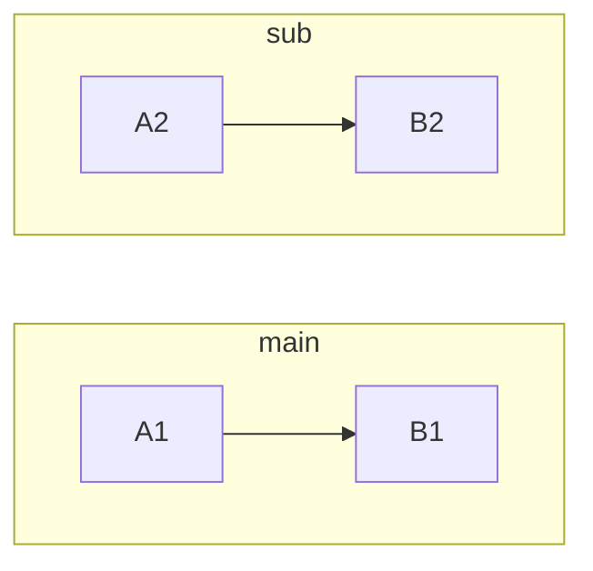
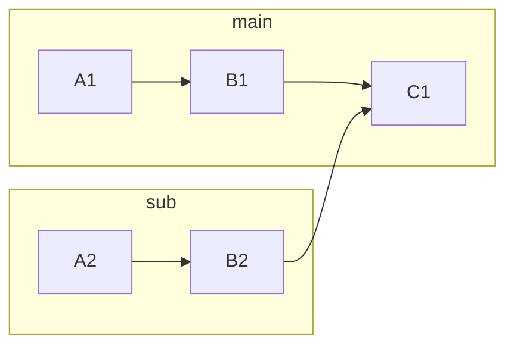
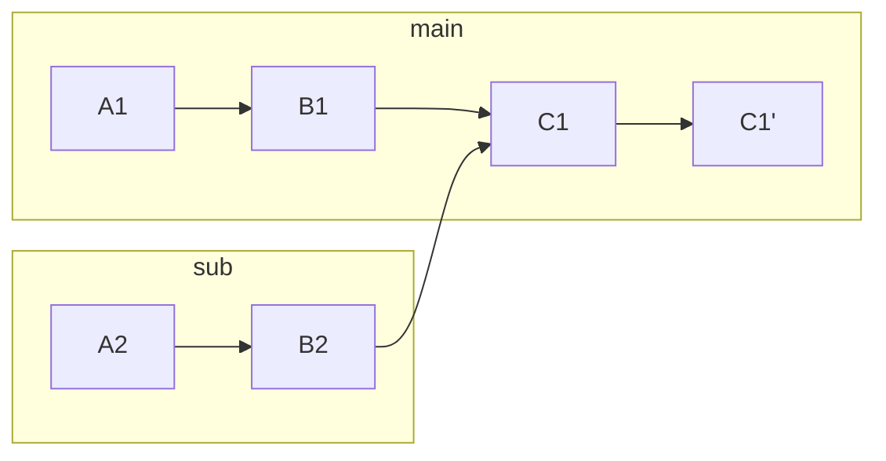
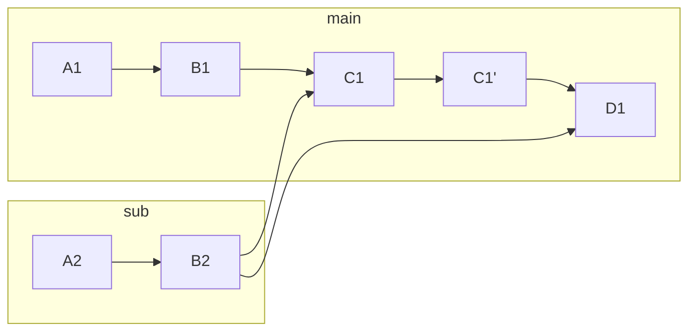
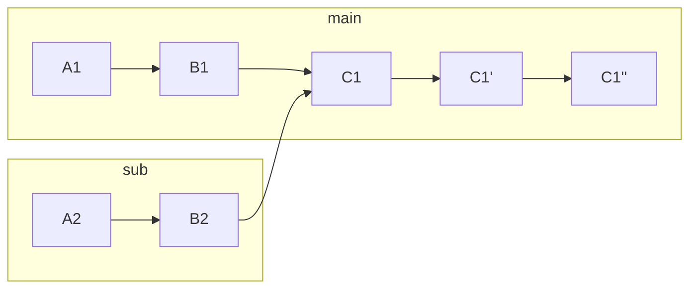

# 기술의 분류

어느 레이어에서 사용되는지에 따라 분류해 볼 수 있겠다.

- 개발 환경 레벨
- 인프라 레벨
- 어플리케이션 레벨
- Dev-ops 레벨


# 개발 환경 레벨

## Git

버전 관리 시스템 (Version Control System) 중 가장 유명하고 널리 쓰이는 것. 생각보다 방대한 기능의 집합이다. 기능들을 일일히 설명하기보단 실수했던 내용이나 새롭게 깨달은 것들은 정리한다.

추가로 [공식문서](https://git-scm.com/book/ko/v2)가 꽤 괜찮다. 

자주사용하는 명령어는 git help everyday 에서 볼 수 있다.

[여기](https://www.codingmax.net/courses/git-commands/section01/lec0013) 도 괜찮다. 

### 자주 사용하는 명령어 (CLI 프레임워크가 alias 만들어주니 참고)
**머지 관련...**
- 머지 취소 : git revert -m 1 {merge_commit}
- 머지 중단 : git merge --abort
- 머지 계속 : git merge --continue
	- 얘는 conflict 를 수정한 후 사용한다.
- 머지 커밋 : git merge --no-ff
	- 기본 옵션을 쓰면 fast-foward 될 수도 있는데, 이러면 머지가 아니라 일반커밋처럼 보일 수 있다. 취향이나 상황에 따라 선택.
- 

**브랜치 관련..**
- 브랜치 보기 : git branch -> 단독으론 쓸 일 없을 것. CLI 프레임워크나 IDE 에서 잘 보여줌.
	- 리모트까지 전부 보기 : git branch -a -> cli 에선 이게 쓸 일 있을지도.
	- 

### 관리하는 공간들 (index, working tree, staged, stash)


### reset, revert, restore 차이

- revert : 역 커밋을 새로 만든다.
- restore : index or commit 을 기준으로 working tree 의 파일들을 되돌린다. 커밋을 새로 하거나 없애지 않음.
- reset : index 를 working tree 로 되돌린다.
	- git add 를 되돌리고 싶을 때. 
	- git commit 을 되돌리고 싶을 때. git reset --soft HEAD\^
	- git merge, git pull 을 되돌리고 싶을 때

### upstream 이란

git branch 에선 자신이 나온 상류 remote branch 를 명시하는데 등장한다.
git branch --set-upstream-to=origin/remote local

git branch -vv 로 로컬 브랜치가 어떤 리모트에서 파생되었는지 볼 수 있다.

새로 브랜치를 만든 경우 upstream 설정해 두면 이후 push pull 시 리모트 지정할 필요가 없어짐.


### 로컬 과 리모트가 다른 경우

당연히 push pull 시 conflict 가 발생할 수 있다. 가장 좋은 건 작업 전 로컬을 업데이트 하는 습관을 들이는 것.

근데 동시 작업중이라 conflict 나는 건 어쩔 수 없음.

conflict 가장 단순한 해결법은 merge 하는 것임. 커밋이 한개라면 fast foward 해서 정리하면 좋다.

merge 하지 말고 그냥 내 커밋을 리모트 커밋 이후에 붙이고 싶을 수 있다. 이 때 rebase 해 준다. (git pull -r)

### merge 와 rebase

merge 는 (fast foward 가 아니면) 머지 커밋을 생성하고, rebase 는 일직선으로 된 커밋으로 정리해 준다.

merge 는 커밋들이 보존된 채로 병합만 한다. 보수적이라고 보면 좋다.

rebase 는 커밋 순서같은게 바뀔수도 있고, 여러 커밋을 합칠수도 있다. push 된 커밋에 대해선 실행하면 안좋다. 대신 브랜치들이 깔끔하게 정리된다.

추가로 주의할 점은 working tree 가 더러운 경우 merge 는 일단 진행되고 나중에 conflict 만 정리하면 되지만 rebase 는 정리하라고 경고한다는 점이다. 

불편하면 git pull -r --autostash 혹은 git fetch 를 쓰자.

### pull 과 fetch

pull 은 working tree 까지 수정된다.

fetch 는 변경점을 체크하기만 한다.

fetch 로 가져온 커밋들은 FETCH_HEAD 에 보관된다. 따라서 git fetch 이후 git merge FETCH_HEAD 를 해주면 git pull 과 동일하다.


### Merge 를 두 번 할수는 없다.

Merge - Revert - Merge 하려다 두 번째 Merge 가 안되서 알게된 내용. Merge 와 일반 커밋은 근본적으로 다르기 때문에 처음에 이해를 못했다.

일반 커밋이라면 Revert 후 다시 똑같은 내용을 커밋할 수 있지만, Merge 는 또 다시 Merge 한다는 개념이 없다. 아래와 같이 두 브랜치가 있다고 하자.



`sub` 브랜치를 머지하면 이렇게 된다.


`C1` 커밋을 취소하면 Revert 커밋이 생긴다.



여기서 다시 `sub` 브랜치를 적용하려고 머지를 하려고 한다. 의도는 아래와 같지만



이렇게 작동하지 않는다. 왜냐하면 머지가 된 브랜치를 또 다시 머지할 수 없어서. 해결책은 `C1'` 을 다시 한 번 리버트 하는 것이다.




이 그래프는 위 그래프 내용과 똑같은 결과를 주게 된다.

### Merge Commit 은 Squash 할 수 없다.

작업물을 몇 번 날려먹은 실수였다. Merge commit 은 다른 커밋과 다르게 좀 특별하게 생각하는게 좋은데, 부모 커밋이 두개라는 점이 Merge commit 을 특별하게 만든다.

다른 한편으론 Squash 의 동작원리를 알면 좋다. 주로 가벼운 커밋들을 합쳐서 똑똑하게 보이게 만들기 위한 명령어인데, 아래의 순서대로 작동한다.
1. Squash 할 커밋들의 이전 커밋으로 `git reset --soft` 한다. `HEAD` 가 Squash 할 커밋들의 이전 커밋을 향한다.
2. 여기서 새로 `git commit` 을 하게 된다. Index (stage) 와 working directory 의 변화들이 하나의 커밋이 된다.

그럼 Merge commit 까지 Squash 를 한다면? 일단 `HEAD` 가 Merge commit 의 부모 커밋을 가르켜야 하는데. 부모 커밋이 두개다. conflic 가 발생하고 더 이상 진행할 수 없다.


# 인프라 레벨


## Apache Kafka


### 설치 (Docker) 및 API 테스트

로그가 너무 길어서 따로 문서를 작성했다.
[[Kafka install (Docker) & Test]]


# 어플리케이션 레벨

## 스프링 관련

### Spring Secure

가장 많이 쓰지만 가장 많이 deprecation 되는 스프링 프로젝트

서블릿 기반 어플리케이션의 경우, http 요청의 필터 체인에 관여하여 작동한다.

톰캣의 필터에 직접 관여하는 건 힘든 일이므로, Proxy, Delegation 을 통해 스프링이 관리하는 빈 형태로 인증을 위한 필터를 추가해준다. 고수준에선 `SecurityFilterChain` 객체를 **여러개** 만들어주는 것을 주로 보게 된다. [공식 문서](https://docs.spring.io/spring-security/reference/servlet/architecture.html#servlet-security-filters)의 코드 예시처럼, 평범하게 스프링 빈으로 `SecurityFilterChain` 을 선언해 여러 필터들을 적용시키고 있다. 예시의 필터들은 미리 정의된 필터들이고, **커스터마이즈한 필터**를 쓰거나, 미리 정의된 과정에 **끼어들려면** 작동 구조를 좀 더 파악해야 한다.

Authentication 을 설명하는 공식문서의 다음 항목은 `Filter` 를 어렴풋 이해한 상태에서 피부에 와닿게 설명되어 있다. 
> `AuthenticationManager` - the API that defines how Spring Security’s Filters perform authentication.

구체적인 인증 방법은 여러가지가 있지만 지금은 두가지 정도만 기억해도 좋겠다.
- Username + password
- OAuth2.0

구체적인 방법을 생각하기 이전에, 추상적인 파트를 먼저 체크하는게 좋다. (어차피 구체적 구현을 수정하는 것 보다, 추상적인 레벨에서 intercept 하는 케이스가 더 많을 것이다.)

`RequestContextHolder` 처럼 `SecurityContextHolder` 가 보안 관련 Context 들을 들고 있다. 인증에 대해선 
1. Principal -> 인증 주체 (~ User)
2. Credentials -> 시크릿 (~Token, ~Password) -> 인증 후 삭제된다
3. Authorities -> 권한 (~ Role, Scope)
... 세가지 요소가 있다. Principal 이란 단어가 좀 낯설었는데, 영문 위키피디아를 찾아보면
> [Principal (computer security)](https://en.wikipedia.org/wiki/Principal_(computer_security) "Principal (computer security)"), an entity that can be identified and verified

한국어론 적당한 단어가 없다. 그나마 보안 주체 정도로 번역할 수 있을 듯.

아무튼 위 세 요소를 가진 `Authentication` 이 Spring Secure 에서 주된 관심사가 될 것이다. `Authentication` 인터페이스의 [문서를](https://docs.spring.io/spring-security/site/docs/current/api/org/springframework/security/core/Authentication.html) 보면 매우 많은 클래스들이 구현하고 있는 걸 알수있다. (많은 클래스들이 구현하고 있다는 건 그만큼 중요하다는 반증이 될 수 있다. 물론 Transaction 처럼 인기있는 몇가지 구현체만 있는 경우도 흔하다.)

`Authentication` 구현체를 보면 인증을 위한 구체적 구현 방법과 일대일 대응된다. 대표적으로
- `BearerTokenAuthenticationToken` 
- `OAuth2LoginAuthenticationToken`
- `UsernamePasswordAuthenticationToken`
... 등이 있다.

Spring Secure 참조문서를 계속 보면 아래처럼 강제로 Context 를 들게 하는 케이스를 볼 수 있다.
```Java
SecurityContext context = SecurityContextHolder.createEmptyContext(); 
Authentication authentication =
    new TestingAuthenticationToken("username", "password", "ROLE_USER"); 
context.setAuthentication(authentication);

SecurityContextHolder.setContext(context); 
```
반대로 Context 에서 인증정보를 가져올 수도 있다.
```Java
SecurityContext context = SecurityContextHolder.getContext();
Authentication authentication = context.getAuthentication();
String username = authentication.getName();
Object principal = authentication.getPrincipal();
Collection<? extends GrantedAuthority> authorities = authentication.getAuthorities();
```
서블릿 구조에서 트랜잭션과 마찬가지로, `ThreadLocal` 을 사용해 Context 를 유지한다. (따라서 **동시성 구현시 주의해야** 한다. Context 를 저장하는 방법도 커스터마이즈 할 수 있다. `SecurityContextHolder.MODE_GLOBAL)

`AuthenticationManager` 는 최상위에서 인증에 사용되는 API 이며 `SecurityContextHolder` 에 대한 어댑터 역할을 한다. `ProviderManager` 는 이 인터페이스의 구현체이고, 여러 `AuthenticationProvider` 를 포함해 사용한다.

`AuthenticationProvider` 는 여러개가 있을 수 있고 각각 특정 타입의 인증 요청에 반응해 인증해줘야 한다. 가장 평범한 구현은 `DaoAuthenticationProvider` 로, username & password 로 인증해준다. 

`AuthenticationEntryPoint` 는 묘한 이름을 갖고 있다. 미인증 요청에 대해 어떤 응답을 줄 것인지에 관한 인터페이스이고, 주로 Login page 로 리다이렉트 하라는 응답을 주기 때문에 EntryPoint 라는 단어가 붙은 것 같다. 

#### 테스트 시 주의사항

Auth server 와 client 를 localhost 에서 돌리면, 도메인 네임을 공유하게 된다.

포트가 다르더라도, 이는 세션이 삭제될 때 문제가 된다. 테스트시에도 도메인 네임을 다르게 해 줘야 한다.

문제가 된 상황 : Auth server, Auth client 로 OAuth2 테스트하는 중, 세션이 의도치 않게 삭제되어 `RequestRepository` 가 원래 요청을 잃어버려 에러나는 현상. `authorization_request_not_found`

해결 : Auth server 는 ip (`http://127.0.0.1:8000`) 으로 두고, Client 는 `localhost:8080` 을 사용해서 헷갈리지 않게 함.

#### 기본 Endpoint

기본 엔드포인트는 이 [문서](https://docs.spring.io/spring-authorization-server/reference/configuration-model.html#configuring-authorization-server-settings)에 설명되어 있다.
- /oauth2/authorize
- /oauth2/device_authorization
- /oauth2/device_verification
- /oauth2/token
- /oauth2/introspect
- /oauth2/revoke
- /oauth2/jwks
- /connect/logout
- /userinfo
- /connect/register

특정 프로토콜에 종속되어 있는 넘들이다.


#### Username + Password

타임어택을 해야한다면 이따위로 해도 된다.
```yaml
spring:
  security:  
    user:  
      name: admin  
      password: password
```

위 설정만으로 `SecurityAutoConfiguration` 이 알아서 `InMemoryUserDetailService` 를 만들어준다. 근데 이 방식은 유저를 더 추가할수도 없다.  위 프로퍼티를 들게되는 `SecurityProperties` 의 필드가 유저 하나만 들고 있기 때문이다.

커스터마이즈를 하려면 `UserDetailService` 혹은 `InMemoryUserDetailService` 를 구현해줘야 한다.
```java
@Bean  
public InMemoryUserDetailsManager inMemoryUserDetailsManager(PasswordEncoder passwordEncoder) {  
	UserDetails user = User.builder()  
        .username("user")  
        .password(passwordEncoder.encode("password"))  
        .build();  
	UserDetails admin = User.builder()  
        .username("admin")  
        .password(passwordEncoder.encode("password"))  
        .build();  
	return new InMemoryUserDetailsManager(admin, user);
}
```

추가로 이 `UserDetailService` 를 사용하는 `AuthenticationManger` 도 지정해준다.
하드코드된 username + password 인증이 완성되었다.

```java
@Bean  
public AuthenticationManager authenticationManager(UserDetailsService userDetailsService, PasswordEncoder passwordEncoder) {  
	DaoAuthenticationProvider authenticationProvider = new DaoAuthenticationProvider();  
	authenticationProvider.setUserDetailsService(userDetailsService);  
	authenticationProvider.setPasswordEncoder(passwordEncoder);  

	return new ProviderManager(authenticationProvider);
}
```

위 코드보단 `AuthenticationProvider` 도 별도의 빈으로 등록해 사용하는게 좋다.

여기까진 개인적인 용도로만 쓴다면 큰 문제 없을지도 모르지만. 단점이 많다.
- User role 이 없다.
- User 관련 정보를 수정하려면 재배포 해야 한다. (암호 바꾼다던지 등등)
- Runtime 에 바꾸는 기능을 넣어도 InMemory 라 서버 재기동시 초기화된다.
- 세션 탈취당하는 것으로 간단히 위장이 가능
이 부분은 금방 테스트해볼 수 있다. 먼저 정삭적인 요청을 하면 이런 헤더가 포함되는데
`Cookie: JSESSIONID=629B6C9985A9FA946E7B2D2811720B10`

헤더를 탈취해서 IDE 에서 따로 요청을 날려도 잘 작동한다.
```
GET http://localhost:8080/secure  
Cookie: JSESSIONID=629B6C9985A9FA946E7B2D2811720B10

HTTP/1.1 200 
Vary: Origin
Vary: Access-Control-Request-Method
Vary: Access-Control-Request-Headers
X-Content-Type-Options: nosniff
X-XSS-Protection: 0
Cache-Control: no-cache, no-store, max-age=0, must-revalidate
Pragma: no-cache
Expires: 0
X-Frame-Options: DENY
Content-Type: text/plain;charset=UTF-8
Content-Length: 6
Date: Sat, 15 Jun 2024 06:45:33 GMT

secure

Response code: 200; Time: 10ms (10 ms); Content length: 6 bytes (6 B)
```


#### OAuth2

Spring Security 의 AuthServer 는 OAuth2 의 여러 프로토콜을 지원한다.

커스터마이즈 해서 사용하겠지만, [Default 설정](https://docs.spring.io/spring-authorization-server/reference/configuration-model.html)을 알면 배움을 시작하기 좋다.

#### OIDC

OAuth2 와 OIDC 는 겹치는 개념이 많아 헷갈린다. [이 글](https://velog.io/@wlsh44/OpenID-Connect%EC%99%80-OAuth2.0)에선 OAuth2 는 인가에 중점을, OIDC 는 인증에 중점을 두었다고 정리하고 있다. OAuth2 의 access token 에 더해 OIDC 는 ID token 을 발행해 (민감하지 않은) 유저 정보를 사용할 수 있다.

Default configuration 을 만들고 나서, 아래 요청을 시도해보자.
`GET http://localhost:8080/.well-known/openid-configuration`

 응답
```
{
  "issuer": "http://localhost:8080",
  "authorization_endpoint": "http://localhost:8080/oauth2/authorize",
  "device_authorization_endpoint": "http://localhost:8080/oauth2/device_authorization",
  "token_endpoint": "http://localhost:8080/oauth2/token",
  "token_endpoint_auth_methods_supported": [
    "client_secret_basic",
    "client_secret_post",
    "client_secret_jwt",
    "private_key_jwt",
    "tls_client_auth",
    "self_signed_tls_client_auth"
  ],
  "jwks_uri": "http://localhost:8080/oauth2/jwks",
  "userinfo_endpoint": "http://localhost:8080/userinfo",
  "end_session_endpoint": "http://localhost:8080/connect/logout",
  "response_types_supported": [
    "code"
  ],
  "grant_types_supported": [
    "authorization_code",
    "client_credentials",
    "refresh_token",
    "urn:ietf:params:oauth:grant-type:device_code",
    "urn:ietf:params:oauth:grant-type:token-exchange"
  ],
  "revocation_endpoint": "http://localhost:8080/oauth2/revoke",
  "revocation_endpoint_auth_methods_supported": [
    "client_secret_basic",
    "client_secret_post",
    "client_secret_jwt",
    "private_key_jwt",
    "tls_client_auth",
    "self_signed_tls_client_auth"
  ],
  "introspection_endpoint": "http://localhost:8080/oauth2/introspect",
  "introspection_endpoint_auth_methods_supported": [
    "client_secret_basic",
    "client_secret_post",
    "client_secret_jwt",
    "private_key_jwt",
    "tls_client_auth",
    "self_signed_tls_client_auth"
  ],
  "code_challenge_methods_supported": [
    "S256"
  ],
  "tls_client_certificate_bound_access_tokens": true,
  "subject_types_supported": [
    "public"
  ],
  "id_token_signing_alg_values_supported": [
    "RS256"
  ],
  "scopes_supported": [
    "openid"
  ]
}
```

Default configuration 에서 위의 엔드포인트들이 사용가능해진다. `oauth2/authorization` 에 요청을 날려보자. 어떤 것들이 필요한지는 Spring Security 문서에서 가르키는 [이 곳](https://datatracker.ietf.org/doc/html/rfc6749#section-4.1.1)에 나와있다.

좀 이상한 건 OIDC 프로토콜인데 왜 OAuth2 프로토콜 엔드포인트를 가르키는가? 인데... 아직은 잘 모르겠다.

암튼 필요한 파라미터를 넣어서 요청한다.
`GET localhost:8080/oauth2/authorize?response_type=code&client_id=oidc-client`

그럼 Consent require 라는 페이지를 보여준다... oidc-client 가 현재 계정에 접근하려고 한다고 하는데, coupang 같은 client 사이트들이 인증을 제공해주는 Kakao 계정에 접근하려는 거라고 생각하면 된다.

Consent 를 누르면 `POST /oauth2/authorize` 를 요청하게 된다. 결과로 코드와 원래 사이트로 redirect 할 주소를 받는다.

사용자 브라우저는 이제 원래 사이트로 redirect 되고, 원래 사이트 서버는 코드를 받아서 Auth server 에게 체크하게 된다. 여기서 `/oauth2/toekn` 엔드포인트를 찌른다.

 
> [!Caution] 주의
> 이런 식으로 인증하고나서, client 에서 `UserDetail` 을 체크해 보면 `null` 이다. OAuth2 로 로그인 한 경우엔 `OAuth2User` 라는 객체를 사용하기 때문에 주의해야 한다.  보통 두 객체를 모두 상속한 객체를 만들어 쓰는 듯.


#### Token

로그인 후 세션 대신 JWT 정도만 사용해서 인증하고 싶은 경우도 있을 것이다.

세션을 드는 대신 클라이언트가 JWT 만 들고있게 하는 방법인데... 

#### 비대칭 암호화 방식

따로 문서를 만드는게 옳겠지만, 짧게 적어본다. 키 하나만 사용해 메세지를 암호화하고 복호화 하는 경우를 대칭 키 암호화 방식이라고 한다. 송신자와 발신자 모두 이 키를 알고 있어야 하므로 키 전송시 탈취 위험이 존재한다.

비대칭 키 암호화 방식은 공개 키를 이용해 암호화를 하고, 비공개 키를 이용해 복호화할 수 있는 방식이다. SSL 인증, 전자서명등에 사용된다.

SSL 에서 대칭키(리소스)를 전달하는 데 사용한다.
- 수신자는 공개키를 공개한다.
- 송신자는 공개키로 리소스를 암호화 해 보낸다.
- 수신자는 암호화된 리소스를 자신의 개인키로 복호화 해 사용한다.
다만 비대칭 암호화는 느리기 때문에, SSL 에서 빠른 대칭키를 알려주는 것에 사용한다. 

전자 서명에 비대칭키가 사용되는 방식은 아래와 같다. (개인키로 암호화 하는 경우다.)
- 리소스 소유자는 개인키와 공개키를 가진다.
- 리소스를 개인키로 암호화 한다.
- 암호화된 리소스를 공개키와 함께 배포한다.
- 위조를 위해선 리소스 -> 암호화된 리소스 를 만들어주는 개인키가 필요하므로, 증명가능한 리소스가 된다.

## QueryDSL

버전별로 build 설정이 다른편이라, 주의가 필요함. (스프링 부트 버전, 그래들 버전, 자바 버전에 의존성이 있음.)

최신 `build.gradle` 설정

```build_gradle
buildscript {  
    ext {  
        queryDslVersion = "5.0.0"  
    }  
}  
  
plugins {  
    id 'java'  
}  
  
dependencies {  
    implementation 'org.springframework.boot:spring-boot-starter-data-jpa'  
  
    // QueryDSL  
    implementation "com.querydsl:querydsl-jpa:${queryDslVersion}:jakarta"  
    annotationProcessor(  
            "jakarta.persistence:jakarta.persistence-api",  
            "jakarta.annotation:jakarta.annotation-api",  
            "com.querydsl:querydsl-apt:${queryDslVersion}:jakarta")  
}  
  
// QueryDSL
clean {  
    delete file('src/main/generated') 
}  
task cleanGeneatedDir(type: Delete) {
    delete file('src/main/generated')  
}
```

## Kafka streams

- 마스터 작업 자동화 할 때 data pipeline 을 만들어야 함.
	- 마스터 파일 (여러 포맷) -> DB 와 비교해서 새로운 부분 추출 -> SQL 로 변환
- 개발환경 Kafka 이용해서 만들 수 있지 않을까? TTL 걸린 토픽을 만들면 영향이 최소화 될 것 같고.
- 현재 스크립트에 있는 오류들도 만들면서 제거할 수 있을 것 같기도 하고.


## 자바 빌드 관련

### Gradle


## 자바 코드 관련

Java 에서 코드 자체를 조작하는 기술에 대해 정리함.

### Mapstruct


### AspectJ


